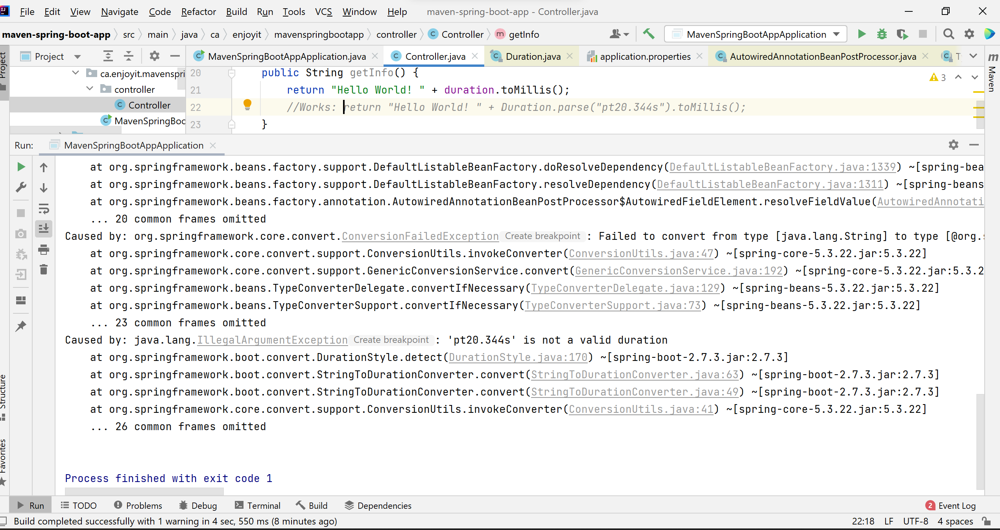
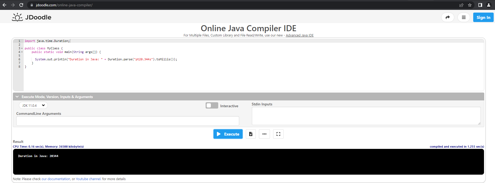

# spring-boot-duration-style-iso8601
Demonstrate the Issue #32218 of Spring Boot for version 2.7.3 with JDK 11

# Steps to Demonstrate Spring Boot Issue #32218
1. Git clone the source code;
2. Type `mvnw.cmd clean package` in the project directory from Windows command line and you will get `BUILD FAILURE` due to the following error:

    `[ERROR] Tests run: 1, Failures: 0, Errors: 1, Skipped: 0, Time elapsed: 1.839 s <<< FAILURE! - in ca.enjoyit.mavenspringbootapp.MavenSpringBootAppApplicationTests`
    
    `[ERROR] contextLoads  Time elapsed: 0.008 s  <<< ERROR!`
    
    `java.lang.IllegalStateException: Failed to load ApplicationContext`
    
    `Caused by: org.springframework.beans.factory.UnsatisfiedDependencyException: Error creating bean with name 'controller': Unsatisfied dependency expressed through field 'duration'; nested exception is org.springframework.beans.TypeMismatchException: Failed to convert value of type 'java.lang.String' to required type 'java.time.Duration'; nested exception is org.springframework.core.convert.ConversionFailedException: Failed to convert from type [java.lang.String] to type [@org.springframework.beans.factory.annotation.Value java.time.Duration] for value 'pt20.344s'; nested exception is java.lang.IllegalArgumentException: 'pt20.344s' is not a valid duration`
    
    `Caused by: org.springframework.beans.TypeMismatchException: Failed to convert value of type 'java.lang.String' to required type 'java.time.Duration'; nested exception is org.springframework.core.convert.ConversionFailedException: Failed to convert from type [java.lang.String] to type [@org.springframework.beans.factory.annotation.Value java.time.Duration] for value 'pt20.344s'; nested exception is java.lang.IllegalArgumentException: 'pt20.344s' is not a valid duration`
    
    `Caused by: org.springframework.core.convert.ConversionFailedException: Failed to convert from type [java.lang.String] to type [@org.springframework.beans.factory.annotation.Value java.time.Duration] for value 'pt20.344s'; nested exception is java.lang.IllegalArgumentException: 'pt20.344s' is not a valid duration`
    
    `Caused by: java.lang.IllegalArgumentException: 'pt20.344s' is not a valid duration `
3. Or just run the Spring Boot application in IntelliJ to see the detailed error:

# Behavior in Java for the Same Use Case
`Duration.parse("pt20.344s").toMillis()` will return `20344` in Java code:

